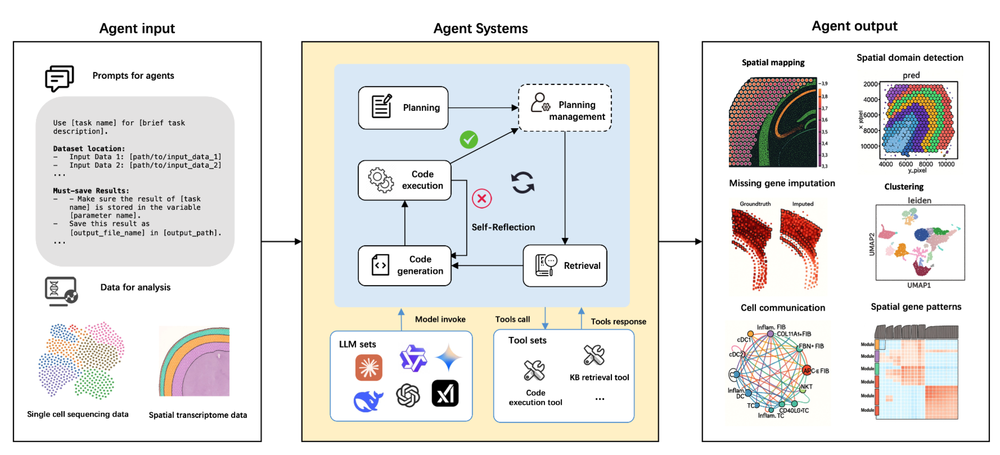

# Benchmarking LLM Agents for Single-cell Omics Analysis

[](https://arxiv.org/abs/XXXX.XXXXX) [](https://claude.ai/chat/89eaffbd-376e-46dc-bdf7-2db7db858d04#dataset) [](https://opensource.org/licenses/MIT)

## Overview

This repository contains the code and data for **"Benchmarking LLM Agents for Single-cell Omics Analysis"**, a comprehensive evaluation framework designed to systematically assess the capabilities of Large Language Model (LLM)-based agents in single-cell omics analysis tasks.

Figure. Overview of the benchmarking framework architecture

## 🔬 Research Highlights

- **Comprehensive Benchmarking Framework**: A systematic evaluation system with 4 interrelated components for assessing LLM agent performance
- **Multi-Agent Support**: Evaluation across ReAct, LangGraph, and AutoGen frameworks
- **Extensive Model Coverage**: Assessment of 8 state-of-the-art LLMs including GPT-4o/4.1, Claude 3.7 Sonnet, DeepSeek R1/v3, Grok3, Gemini 2.5, and Qwen 2.5
- **Curated Task Dataset**: 50 representative single-cell omics analysis tasks with gold-standard outputs
- **17 Quantitative Metrics**: Comprehensive evaluation across cognitive synthesis, task quality, knowledge integration, and collaborative efficiency

## 🏗️ Framework Architecture

Our benchmarking framework consists of four key components:

### 1. Benchmarking Pipeline

- **Multi-framework Support**: ReAct, LangGraph, and AutoGen implementations
- **Plan-Execute-Reflect Loop**: Dynamic task adaptation with autonomous tool orchestration
- **Comprehensive Logging**: Full monitoring and evaluation of agent execution processes
- **Flexible Input/Output**: Support for scRNA-seq, spatial transcriptomics, and multi-modal data

### 2. Evaluation Metrics

- **17 Quantitative Metrics** across four dimensions:
    - Cognitive Program Synthesis
    - Task Quality Assessment
    - Knowledge Integration
    - Collaborative Execution Efficiency
- **Robustness Analysis**: Prompt variation testing and architectural component influence

### 3. LLM and Agent Framework Integration

- **8 LLM Models**: GPT-4o/4.1, Claude 3.7 Sonnet, DeepSeek R1/v3, Grok3, Gemini 2.5, Qwen 2.5
- **3 Agent Frameworks**: ReAct, LangGraph, AutoGen
- **Comparative Analysis**: Workflow orchestration, memory management, and scalability assessment

### 4. Single-Cell Omics Task Dataset

- **50 Curated Tasks** spanning:
    - Cell type classification
    - Trajectory inference
    - Multi-modal data integration
    - Spatial transcriptomics analysis
- **Multi-language Support**: Scripts in Python, R, and other relevant languages
- **Gold-standard Outputs**: Reference results for systematic evaluation

## 📊 Dataset

**Download Dataset**: *(to be updated soon)*

## 🚀 Quick Start

*(to be updated soon)*

## 📈 Evaluation Results

Our evaluation reveals:

- **Performance Variations**: Significant differences across LLM models and agent frameworks
- **Task-Specific Strengths**: Different agents excel in different types of single-cell analysis
- **Framework Trade-offs**: Distinct advantages in control granularity, scalability, and robustness
- **Integration Capabilities**: Varying success in multi-modal data analysis and tool orchestration

Detailed results and analysis will be available in our paper and the `results/` directory soon.


## 📄 Citation

If you use this framework or dataset in your research, please cite our paper:

```bibtex
@article{author2024benchmarking,
  title={Benchmarking LLM Agents for Single-cell Omics Analysis},
  author={Author, First and Author, Second and Author, Third},
  journal={arXiv preprint arXiv:XXXX.XXXXX},
  year={2025}
}
```


## 📋 License

This project is licensed under the MIT License - see the [LICENSE](https://opensource.org/licenses/MIT) file for details.


---

**Keywords**: Large Language Models, LLM Agents, Single-cell Omics, Benchmarking, Computational Biology, scRNA-seq, Spatial Transcriptomic
